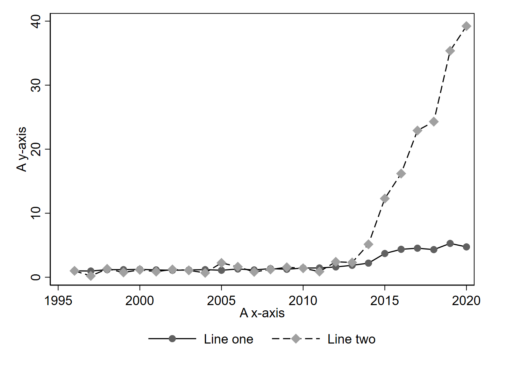
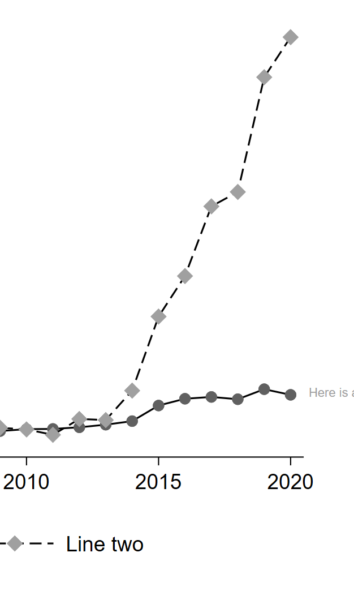
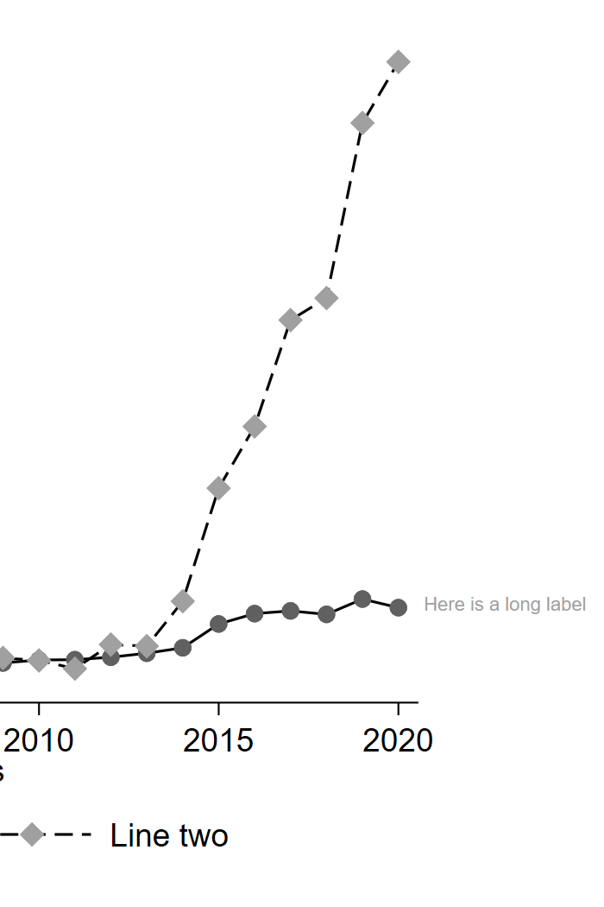

1. TOC
{:toc}

---

## Changing the Plot Region

In Stata, the area where the actual data appears is called the plot region and its elements are modified via the `plotregion()` twoway options (see `help region_options`).

### Removing the Border

In some schemes, Stata outlines the top and right borders of the graph. To remove these, use

```
plotregion(lstyle(none))
```




### Extending the Plot Region

Sometimes, it is useful to extend the margins of the plot region to accomodate text, for instance. We can do this
by editing the graph region via the `margin()` option (see `help region_options`)

In this case, I'm adding 17 units to the right margin of the graph region. There are many ways to specify this option, see `help marginstyle`.

```
graphregion(margin(r+17))
```

<p float="left">
  
  
</p>
